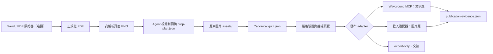

# 架構說明

## 目標

本專案將「原始數學試卷」與「Wayground 平台操作」解耦。題目先形成平台中立且可驗證的 `quiz.json`，之後才選擇 connector、瀏覽器或離線匯出。

## 分層

### 1. Source layer

- 原始 Word／PDF 永遠只讀。
- `ingest` 會保存來源 SHA-256、正規化 PDF 與每頁 PNG。
- 原始檔不應被複製到公開 repo。

### 2. Extraction layer

- Agent 以視覺能力檢查頁面並建立 `crop-plan.json`。
- 裁切座標優先使用 `ratio`，避免 DPI 改變後失效。
- OCR 只能協助定位；不可用來默默重打複雜數學式。
- 題幹、圖形、表格與原卷選項可保留在同一張圖片。

### 3. Canonical layer

`quiz.json` 保存：

- 題目與選項
- 正確答案
- 認知層次
- 來源文件與頁碼／裁切框
- 題目圖片與替代文字
- 答案位置平衡與洗牌設定

完整欄位見 `skills/wayground-math-quiz/references/quiz-schema.md`。

### 4. Validation layer

嚴格驗證檢查：

- 必填欄位與 ID 唯一性
- 圖片資產存在
- 正確答案必須對應選項
- 答案位置分布
- 圖片題必須 `shuffleOptions=false`
- 敏感欄位與危險資料

離線 `preview.html` 讓教師在發布前檢查全部題目。

### 5. Adapter layer

| Adapter | 輸出 | 寫入平台 |
|---|---|---|
| `wayground-mcp` | 文字題 connector payload | 由可用 connector 完成 |
| `wayground-browser` | 穩定的瀏覽器操作計畫 | 由已登入瀏覽器完成 |
| `export-only` | 可攜式題目套件 | 不寫入 |

瀏覽器 selector 不寫死在 skill；每次操作都使用最新 accessibility snapshot 與可見標籤。

### 6. Evidence layer

發布後保存：

- 乾淨的 Wayground URL
- 驗證時間
- 題數
- `shuffleOptions=false`
- 發布頁、代表題目與設定截圖

`verify` 會同時檢查 `quiz.json` 與 `publication-evidence.json`。

## 圖片比例策略

Wayground 預覽可能把圖片放入約 400 px 的媒體框。過度橫長的原卷截圖即使裁切正確，也可能縮得難以閱讀。

可建立 `*-screen.png`：

1. 只使用原始裁圖中的像素區段。
2. 將題幹、圖形與選項重新排成較適合螢幕的比例。
3. 不重打、改寫或重繪數學內容。
4. 保留原始 crop 作為 provenance。
5. `quiz.json` 指向實際發布的 screen variant。

## MCP 邊界

`mcp/server.mjs` 是 CLI 的薄包裝，讓支援 MCP 的 agent 呼叫：

- doctor
- init／ingest
- crop／assemble
- answer-plan
- validate／preview
- publish／verify

MCP server 不保存登入狀態，也不替 agent 繞過 Wayground UI 權限。圖片上傳仍由使用者已登入的瀏覽器完成。

## 可攜性

- Skill 內不得硬編碼使用者名稱、雲端硬碟或 Python 絕對路徑。
- 主要 CLI 使用 Node.js；影像處理使用 Python。
- Windows 指令使用 PowerShell。
- Agent 特定的安裝目錄只存在於安裝腳本或安裝文件。
- 核心 skill 與 Codex plugin mirror 必須通過遞迴 SHA-256 parity。

## 安全與著作權

- 公開 repo 不包含來源題庫、學生資料或平台截圖。
- 私人 job 可以保存來源路徑，但公開套件必須移除絕對路徑。
- 發布到 Wayground 前，使用者必須有合法使用與分享題目的權限。
- 未明確授權時，不改公開能見度、不建立班級作業、不啟動即時遊戲。
