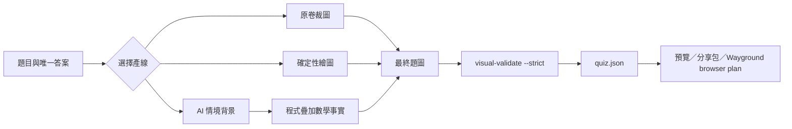

# 視覺題工廠架構

v0.3 將圖片題從「原卷裁圖」擴充為三條可重複產線：



## 設計原則

- `quiz.json` 仍是測驗真相來源。
- `visual-spec.json` 是單張視覺題的重製來源。
- AI 只畫情境背景，不決定數學事實。
- 所有會影響答案的值都列入 `lockedFacts`。
- 最終 PNG 經確認後直接保存，不要求其他 agent 重新生圖。
- 分享包同時保留最終圖片、規格、AI 背景、提示詞與驗證報告。

## CLI

```powershell
node ".\skills\wayground-math-quiz\scripts\quiz.mjs" visual-init `
  --out ".\visual\q001\visual-spec.json" `
  --mode "ai-composite"

node ".\skills\wayground-math-quiz\scripts\quiz.mjs" compose `
  --spec ".\visual\q001\visual-spec.json" `
  --out ".\visual\q001\final.png"

node ".\skills\wayground-math-quiz\scripts\quiz.mjs" visual-validate `
  --spec ".\visual\q001\visual-spec.json" `
  --image ".\visual\q001\final.png" `
  --strict
```

完整欄位與 AI 合成規則見 [技能參考文件](../skills/wayground-math-quiz/references/visual-question-factory.md)。

## 六題候選版

[visual-question-factory](../examples/visual-question-factory/) 包含：

1. 天平方程式。
2. 數線移動。
3. 火柴棒規律。
4. 校園商店價格謎題。
5. 密室三線索。
6. 漫畫列式判斷。

前三題是確定性繪圖，後三題是 AI 背景加精準圖層。答案位置為 `A, B, C, D, A, B`，分布差不超過一。

## 發布邊界

候選版確認前：

- 不同步其他三個 agent。
- 不執行 `chezmoi add`。
- 不推送 GitHub。

確認後才執行 plugin mirror、四端安裝、chezmoi 與 GitHub 發布流程。
